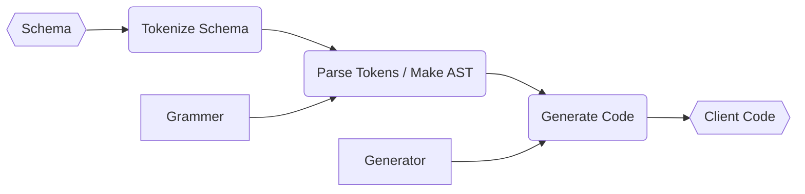

# Architecture



## Tokenize

`Tokenize` is to divide soil-schema into tokens, meaningful string fragments.

Token can be a value literal, string, number, boolean or null, a identifier for block structures, a schema comment, etc.
Most important are tokens whose meaning cannot be determined during tokenization.
These are determined to be ambiguous tokens and are passed to the parser.

## Parse

`Parse` is the process of making AST from a sequence of tokens by applying `Grammar` rules.

The `Grammar` of soil-schema is based simple rules.

```
directive
  -> annotation? directive_name directive_definition? block? '\n'
annotation
  -> alphabetical string
directive_name
  -> alphabetical string
directive_definition
  -> any string
block ->
  '{' block_content '}'
block_content
  -> directive block_content?
```

In actuality, the strings allowed as `Directive` and `Annotation` are dynamically predefined.
soil-schema has default declarations of `Directive` and `Annotation`.

## Generate

`Generate` is to actually make client code files for API with parsed AST.

There is a generator for each programming language of the client code.
For example, there is SwiftGenerator for Swift.
You can also write your own generator.

If you want to modify an existing generator, you can use `Hook`.
